# Points of Interest Explorer

## Contents
* [Introduction](#anchor1)
* [Usage instructions along with screenshots](#anchor2)
* [Error screens](#anchor3)
* [Development Platform](#anchor4)
* [Libraries Dependencies](#anchor5)

##  Introduction
Points of Interest Explorer is a Java (JFrame) client application which consumes the Google Places RESTful API through the Nearby Search and Place Photo HTTP requests.

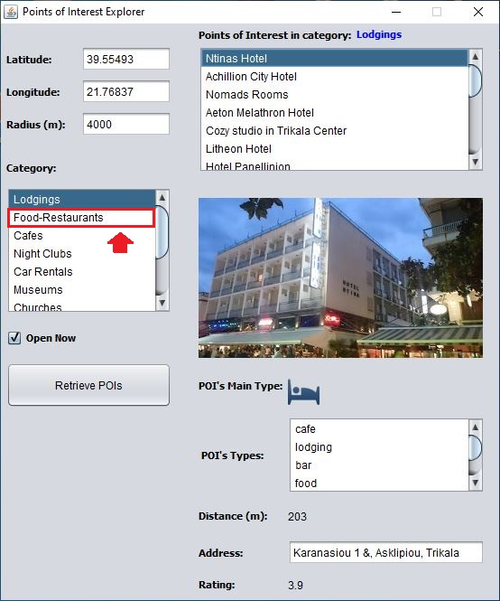

Specifically, the app receives Points of Interest (POIs) nearby a specific location, which the user defines each time via its latitude and longitude, and according to some other restrictions. These restrictions include:

    1) the desired radius for search from the defined location,
    2) the POI's type, and
    3) if it's open at the time of the search.

After the "Retrieve POIs" button is clicked, a list of POIs (that belong to the selected category) is displayed on the top right part of the GUI. Also, after choosing a POI from this list, some extra information with regard to this POI will be displayed on the bottom right part of GUI, that is:

    1) an icon that indicates the main type of activity of this POI,
    2) the distance from the current location,
    3) its address,
    4) the users' rating, and
    5) a photo for this POI.

Furthermore note that this app contains only the following supported types of Google Places API:
- lodging
- food
- cafe
- night_club
- car_rental
- museum
- church
- hospital
- pharmacy
- police
- post office

##  Usage instructions along with screenshots

1) Initially, when the application starts, the user must fill in all the required position fields, namely the latitude and longitude of the desired position, as well as the radius that determines the area inside which to look for points of interest. The latitude and longitude fields can be decimal numbers of double-precision while the radius field must be a positive integer with a maximum value of 50000 meters.

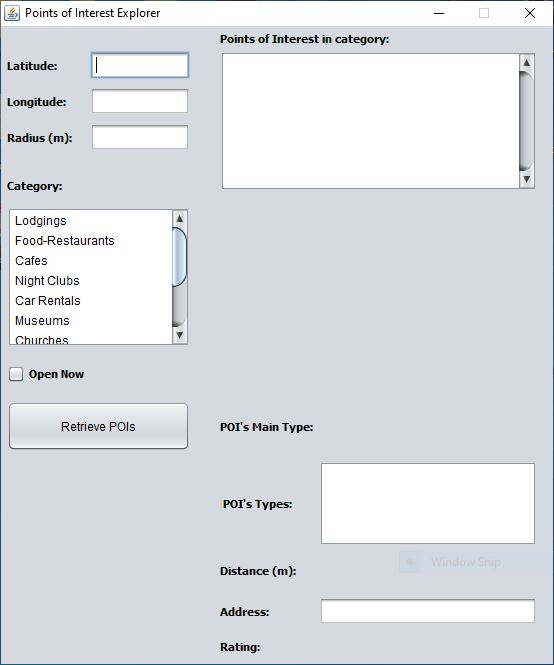

2) Also, it is necessary for the user to select exactly one type (category) for which the application will search for relevant points of interest. Furthermore, the user can optionally tick the "Open Now" check box if she wishes to search for POIs that are open at that moment. After the user has set all search restrictions, he can click on the "Retrieve POIs" button to retrieve the desired POIs.

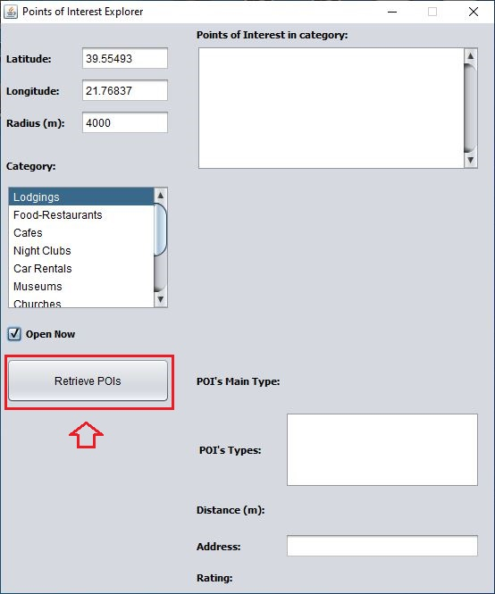

3) Then, a list of POIs is displayed on the right top corner of this app, where the user can select a desired POI for which to view extra info.

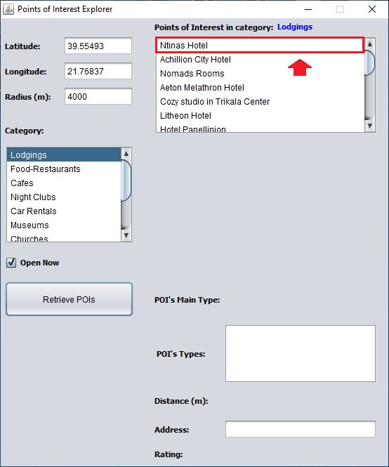

4) In the next screenshot, we can see a photo as well as all the desired information about this POI, including an icon for the POI's main type, the POI's types, its distance from the specified location, its address, and the users' rating. Then, if the user wishes to search for new POIs in another category, he can click on the corresponding item of categories' list.

5) And click again on the "Retrieve POIs" button to get a new list a POIs.

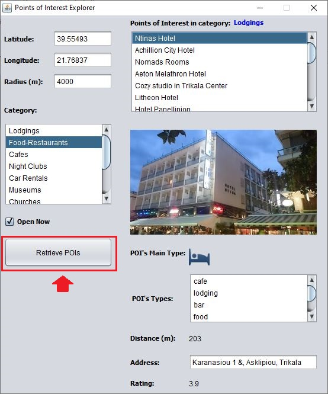

6) When the new list of POIs has been retrieved, the user can select a new POI again.

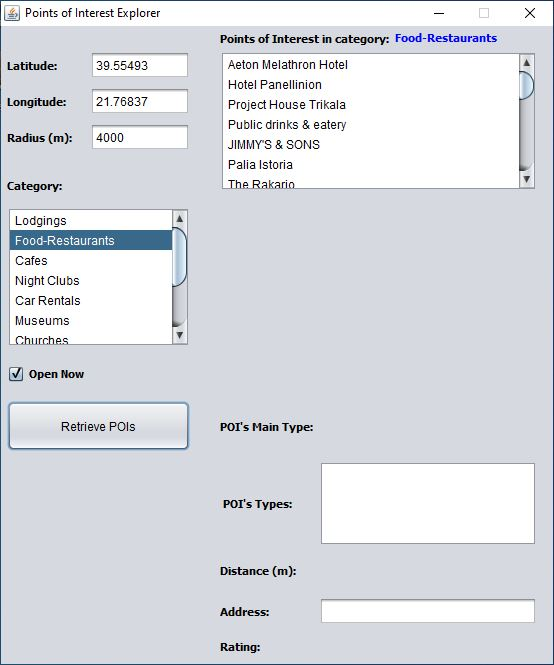

7)  After the new POI has been selected, we can view all the desired information about it.

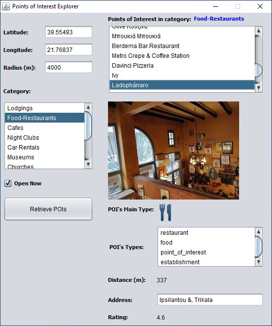

##  Error screens
In this part, we can see all the posible error screens which are displayed when an input field is not valid.

The latitude field must not be empty.

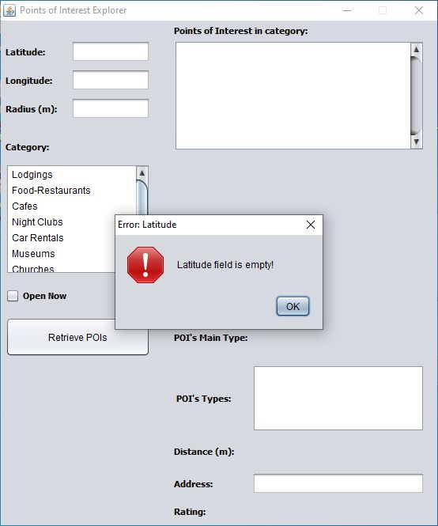

The latitude field must contain a number of double-precision.

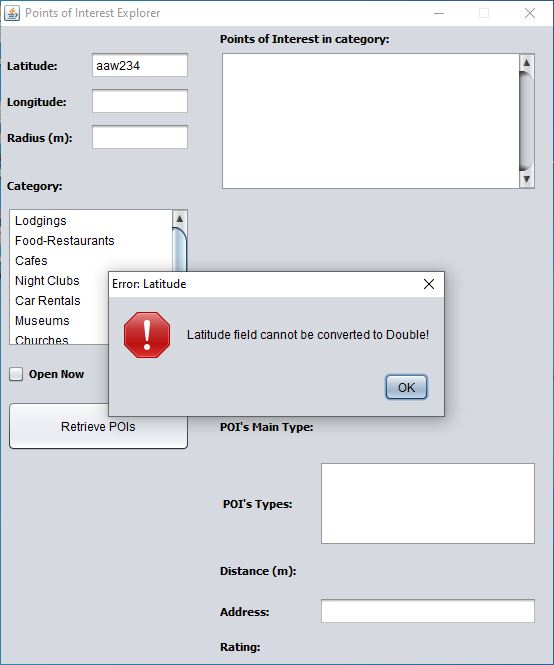

The longitude field must not be empty.

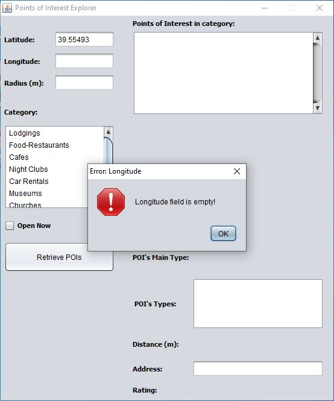

The longitude field must contain a number of double-precision.

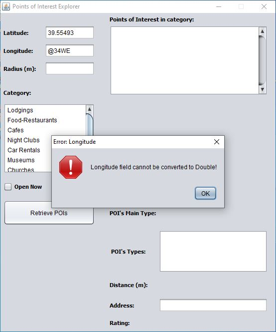

The radius field must not be empty.

The radius field must be a positive integer with a maximum value of 50000 meters, due to an API's restriction for the radius.

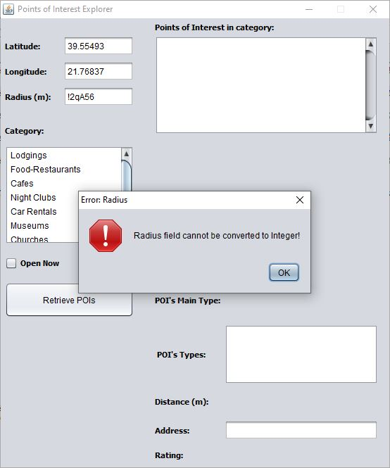
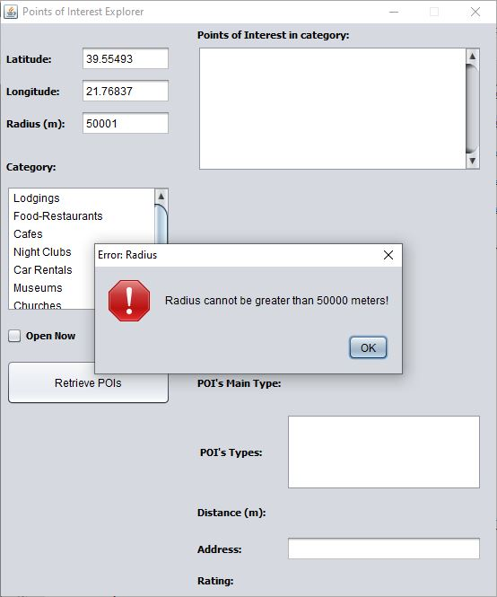

A category must always be selected to retrieve a list of POIs.

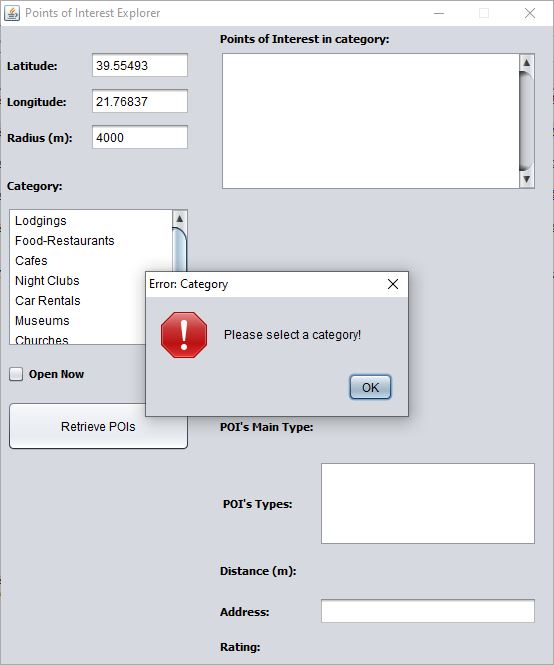

##  Development Platform
The application was developed in Java programming language (with JDK 1.8.0_231 x64) by using the NetBeans IDE platform (v8.2 x64).

##  Libraries Dependencies
The project depends on the following extra libraries (.jar files) which must support: A) a HTTP client for sending GET requests to the API, and B) the parsing of this API's responses in JSON format.

A) [Apache HttpClient (v4.5.10)](https://mvnrepository.com/artifact/org.apache.httpcomponents/httpclient/4.5.10) library and some necessary dependencies:
- httpclient-4.5.10.jar
- httpcore-4.4.12.jar
- commons-codec-1.11.jar
- commons-logging-1.2.jar

B) [JSON In Java (v20190722)](https://mvnrepository.com/artifact/org.json/json/20190722) library:
- json-20190722.jar

All the dependent libraries are contained in the dist/lib folder of this project.
